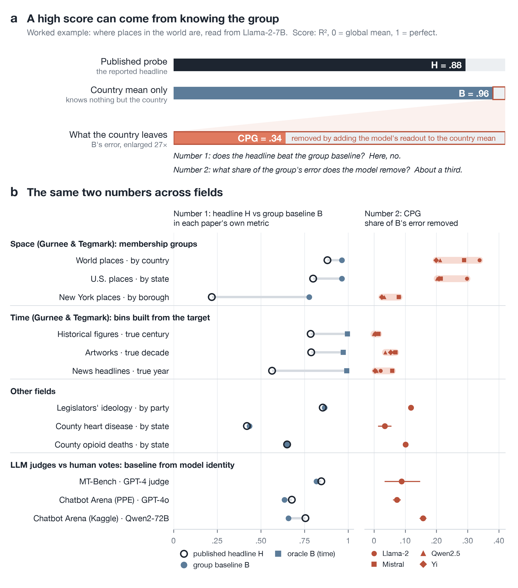

# two-numbers: what aggregate scores hide

Check whether a headline score could come from group membership alone, and measure what a model adds beyond the group.



*Figure 1 of the paper. (a) Where places in the world are, read from Llama-2-7B: the published probe scores R² .881, training-set country means alone score .963, and adding the model's readout to the country means removes .338 of the error they leave. (b) The same two numbers for every matched case in the paper. The time baselines (squares) are built from the target, not from group membership. Points are estimates. Space/time bands show the four-model range, not confidence intervals. Judge gains use nested Brier CPG. The heart-disease point is a median across partitions, with the interval from partition 0. Full interval definitions and additional uncertainty estimates, including the Yi World interval reaching zero under whole-country resampling, are in the paper.*

## Why

A score can look like evidence of fine-grained knowledge when a predictor that knows only the group would score as high. Examples from the paper:

- **Places in the world** (Gurnee & Tegmark, Llama-2-7B): the published probe's R² is .881; training-set country means alone give .963. Adding the model's readout to the country means removes .338 of the error they leave, so the model's representation does predict position below the country.
- **County heart-disease mortality from Twitter** (Eichstaedt et al., 2015): the published correlation is r = .42; knowing only each county's state gives .435 under the same protocol.
- **Legislators' ideology from an attention head** (Kim, Evans & Schein, 2025): the published Spearman correlation is .854; party alone gives .864. Within party, with the head selected within each training fold, the activations still remove .118 of the party baseline's squared error.
- **LLM judges vs human votes** (retained non-tie votes; Kaggle also requires order-consistent verdicts): a model-identity baseline calibrated on human votes from other questions in the same collection agrees with humans .818, .635 and .658 of the time on MT-Bench, PPE and Kaggle Chatbot Arena; the judges agree .846, .677 and .755 of the time, and reduce the baseline's disagreement rate by 12-28%. The baseline reads no answer content but uses human-labelled calibration data.

Two baseline-only sanity checks also preserve large gaps: for Othello-GPT's board state and for protein stability predicted with TAPE, the published predictor stays far above the tested baseline (Supplement E).

## Quick start

```
pip install -r requirements.txt
python examples.py        # three synthetic cases with known answers
python two_numbers.py data.csv --y lat,lon --group country --test is_test --pred p_lat,p_lon --metric r2
```

For the last line, provide your own `data.csv` (not bundled), with one row per unit: the target columns (`lat,lon`), the group (`country`), a test flag (`is_test`, 1 on test rows) and your model's out-of-sample predictions of the target (`p_lat,p_lon`).

## What it reports

The tool answers one question: **when a target is grouped, how much of a headline score does the group alone give, and what does a representation add below the group?**

It reports two numbers next to any published headline *H*:

- **B, the group baseline**: a predictor that knows only each unit's group (the training-set mean of its group), scored with the same metric as *H* (R², Pearson, Spearman or AUROC). If *B* reaches *H*, the headline score alone does not require any predictive structure below the group.
- **CPG, the conditional predictive gain**: `1 - SSE(full) / SSE(group mean)` on held-out rows, where the full predictor adds the representation to the group mean. It comes with a 95% row-bootstrap interval, a whole-group interval (when there are at least 20 groups), an exact split into a cell-mean part and a within-cell part, a within-group permutation test, a joint (group-centred) fit on the feature route, and an optional resolution profile across grouping levels.

An interval that includes zero is not evidence that information is absent.

## Use from Python

```python
import two_numbers as tn
# y: target (n,) or (n, k); g: group labels (n,); train: boolean mask (n,)
R = tn.report(y, g, train, X=features)            # fits the probes itself
R = tn.report(y, g, train, pred=predictions)      # or uses ready out-of-sample predictions
print(tn.format_report(R))
```

## Use from the command line

```
python two_numbers.py data.csv --y lat,lon --group country --test is_test --pred p_lat,p_lon --metric r2
```

## Example and tests

```
python examples.py     # three synthetic cases with known answers: knowledge within groups, group only, a finer category
python tests.py        # edge cases: train-only means, perfect baseline, missing labels, inner-fold isolation
```

## How it fits the probes

With features, the standard probe is a ridge regression on the target. The residual probe is a ridge regression on the target minus the group mean; its penalty is chosen by 5-fold cross-validation in which the group means (and, for the joint fit, the feature centring) are recomputed from each inner training fold only. Test rows of groups unseen in training use the global training mean, and are counted in the report.

## What it does and does not do

- `pred` must be aligned **total** predictions of the target for every row (only test rows are scored), not residuals.
- The joint (group-centred) fit is available only on the feature route (`X`), not with ready predictions.
- The **CPG is always squared-error based**, even when the headline metric is Spearman, Pearson or AUROC; only *B* and *H* use the headline metric.
- With a multivariate target, the primary CPG is the mean of the per-axis ratios; the pooled version is reported beside it.
- The resolution profile scores the **same fixed predictions** against the means of other grouping levels; it does not refit a probe per level.
- `report` handles **one outer train/test split**. It is not designed for pooled predictions from several cross-validation folds, where group means differ by fold.
- Intervals condition on the fitted predictions (no refitting). If some bootstrap draws are undefined (for example, a resample whose baseline has zero error), they are excluded and their share is shown; an undefined interval is reported as such.
- The feature route needs at least 10 training rows.

## Reference

Elboim, A. (2026). *What Aggregate Scores Hide: Group Baselines for Fine-Grained Claims.* Preprints.org (the DOI will be added here when the preprint is posted).

Software archive (reserved DOI; the record will become public after the preprint is posted): Zenodo, doi: [10.5281/zenodo.23110289](https://doi.org/10.5281/zenodo.23110289). Version 1.0.0. See `CITATION.cff`.

License: MIT.
